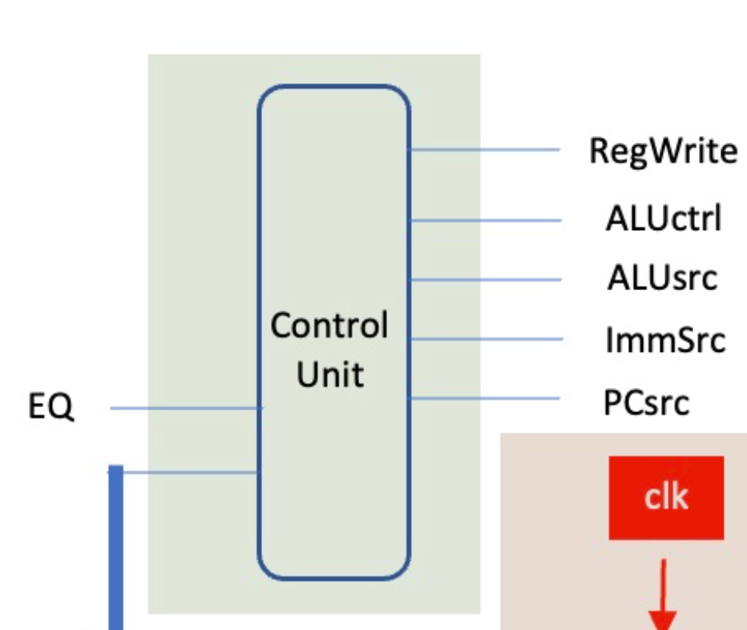

# Control Unit



### The following instructions are to be implemented:
#### `addi`

Add immediate. Add the value of an immediate to the value of a register and store the result in another register.

*Required control signals*

* Enable `RegWrite` so value can be stored in reg
* Set `ImmSrc` to the correct format
* Set `ALUsrc` to `1` to select `ImmOp` as the second operand
* Set `ALUctrl` to value that selects the *SUM* operation

#### `bne`

Branch not equal. If the operands from the previous instruction are not the same then change the PC to PC + the value of the immediate.

**NOTE:** 
*The implementation is based on the diagram in the lab, where the branching is based only on the value of the immediate and not of the register*

*Required control signals*

* Check on input `EQ` to decide whether to branch or not
* Set `ImmSrc` to the correct format
* If branching is happending then set `PCsrc` to `1` to change the next program counter to PC + Imm

#### `lw` 

Load word. Load into a register the word at the address given by another register and offset by the immediate.

***Requires significant changes to the components***

### Technical details

Instruction | opcode | funct3 | funct7 | Type
--- | :---: | :---: | :---: | :---: 
*`addi`* | `0010011` | `000` | - | I 
*`lw`* | `0000011` | `010` | - | I 
*`bne`* | `1100011` | `001` | - | B 

It can be observed that each opcode uniquely identifies each instructions so the funct are redudant for now.

### Testing

```
Running simulation
ADDI 
RegWrite: 1
ALUctrl: 00
ALUsrc: 1
ImmSrc: 000
PCsrc: 0

BNE false
RegWrite: 0
ALUctrl: 00
ALUsrc: 0
ImmSrc: 000
PCsrc: 0

BNE true
RegWrite: 0
ALUctrl: 00
ALUsrc: 0
ImmSrc: 011
PCsrc: 1
Simulation completed
```

Outputs are as intended.

### Notes

* A package was created to hold the type definitions common to the control logic blocks. This can be further extended to other modules in the CPU.
	* To have proper compilation the package (`types_pkg.sv` in this case) must be placed before the other files. In turn the `--top-module` flag must be specified in order to get the correct file names and structure. For example:
		```sh
		verilator -Wall --cc --trace types_pkg.sv control_unit.sv --top-module control_unit --exe control_unit_tb.cpp
		```
* In the combinational logic block the outputs are initialized to zero so that they always hold that default value. This prevents rogue HIGH signals where not desired.

