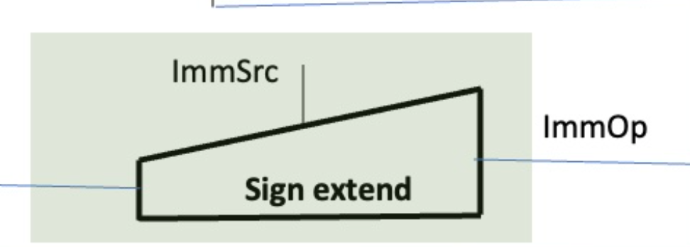

# Control Logic

Two modules which handle the control logic for the CPU. It probably makes sense to keep these modules separate in the final top level design. It might also make sense to separated the control unit block further into two modules according to lecture 7. 

## Control Unit


### The following instructions are to be implemented:
#### `addi`

Add immediate. Add the value of an immediate to the value of a register and store the result in another register.

*Required control signals*

* Enable `RegWrite` so value can be stored in reg
* Set `ImmSrc` to the correct format
* Set `ALUsrc` to `1` to select `ImmOp` as the second operand
* Set `ALUctrl` to value that selects the *SUM* operation

#### `bne`

Branch not equal. If the operands from the previous instruction are not the same then change the PC to PC + the value of the immediate.

**NOTE:** 
*The implementation is based on the diagram in the lab, where the branching is based only on the value of the immediate and not of the register*

*Required control signals*

* Check on input `EQ` to decide whether to branch or not
* Set `ImmSrc` to the correct format
* If branching is happending then set `PCsrc` to `1` to change the next program counter to PC + Imm

#### `lw` 

Load word. Load into a register the word at the address given by another register and offset by the immediate.

***Requires significant changes to the components***

### Technical details

Instruction | opcode | funct3 | funct7 | Type
--- | :---: | :---: | :---: | :---: 
*`addi`* | `0010011` | `000` | - | I 
*`lw`* | `0000011` | `010` | - | I 
*`bne`* | `1100011` | `001` | - | B 

It can be observed that each opcode uniquely identifies each instructions so the funct are redudant for now.

### Testing

```
Running simulation
ADDI 
RegWrite: 1
ALUctrl: 00
ALUsrc: 1
ImmSrc: 000
PCsrc: 0

BNE false
RegWrite: 0
ALUctrl: 00
ALUsrc: 0
ImmSrc: 000
PCsrc: 0

BNE true
RegWrite: 0
ALUctrl: 00
ALUsrc: 0
ImmSrc: 011
PCsrc: 1
Simulation completed
```

Outputs are as intended.

### Notes

* A package was created to hold the type definitions common to the control logic blocks. This can be further extended to other modules in the CPU.
	* To have proper compilation the package (`types_pkg.sv` in this case) must be placed before the other files. In turn the `--top-module` flag must be specified in order to get the correct file names and structure. For example:
		```sh
		verilator -Wall --cc --trace types_pkg.sv control_unit.sv --top-module control_unit --exe control_unit_tb.cpp
		```
* In the combinational logic block the outputs are initialized to zero so that they always hold that default value. This prevents rogue HIGH signals where not desired.

---

## Sign Extension Unit



The immediate operand comes from different types of instructions and has varying size. The sign extend unit converts the immediate operand from the different instructions into a `32-bit` value and sign extends it.

The different instructions are in the following format:


This can be broken down into

* *Immediate*: 12 bits 
	* [11:0] from bit 31 to 20
* *Upper Immediate*: 20 bits 
	* [31:12] from bit 31 to 12
* *Store*: 11 bits 
	* [11:5] from bit 31 to 25
	* [4:0] from bit 11 to 7
* *Branch*: 13 bits, where the 0th bit is ignored because the branching instruction is executed on addresses which use byte-addressing. See lecture 6 Slide 20
	* [12] on bit 31
	* [11] on bit 7
	* [10:5] between bit 30 to 25
	* [4:1] between bit 11 to 8
* *Jump*: 21 bits
	* [20] on bit 31
	* [19:12] between bit 19 and bit 12
	* [11] on bit 20
	* [10:1] between bit 30 and bit 21

Therefore the `Sign extend` modules needs an input `ImmSrc` in order to distinguish between different types of immediates. The logic to determine this input will be implemented in `Control Unit`.

---

### I/O spec

* `ImmSrc` **[Input]** Coming from the control unit and encodes which instructions is being executed
	* There are 5 different instruction formats therefore 3 bits are needed:

        | Instruction Format | Code
        | --- | ---  
        | Immediate | 0b000
        | Upper Imm | 0b001
        | Store | 0b010
        | Branch | 0b011
        | Jump | 0b100

* `ImmOp` **[Output]** 32-bit sign extended immediate

---

### Testing

* *Store instruction*

	Using online assembler the following instructions are passed
	```as
	/* store instruction */
	sw x1, 100(x2)
	sw x1, -100(x2)
	```
* *Other instructions* 
	
	Painfully inserting values by hand in the correct bit location. Testbench shows circuit working as intended:

	```
	imm
	57: 57
	-57: -57
	upper imm
	big num: 59768832
	another big: 59768832 original: 59768844
	negative big: -59768832
	store
	100: 100
	-100: -100
	branch
	57 x 2: 114
	-57: -58
	jump
	57: 56
	-57: -58
	```


	