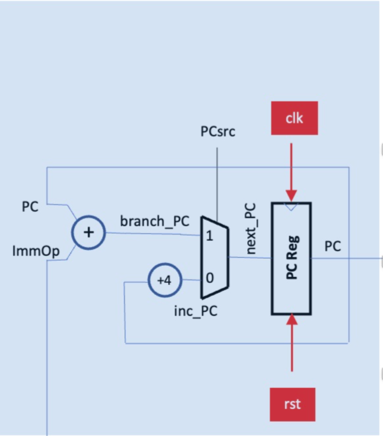

# Logbook: Lab 4
## Part 1 : Program Counter and related adders.

- [Logbook: Lab 4](#logbook-lab-4)
  - [Part 1 : Program Counter and related adders.](#part-1--program-counter-and-related-adders)
    - [What I did:](#what-i-did)
    - [Traces analysis:](#traces-analysis)
    - [Problems encountered:](#problems-encountered)

### What I did: 
* Creation of a programme counter incorporating branches (ImmOp) / normal (+4) increments. 

* **TWO** modules are used: 
  *  <ins>*PC*</ins>: 
     * Flip-flop that takes the *next_PC* as input and set ` PC = next_PC ` If *rst* is 1 &rarr; ` PC = 32'b0 `
  * <ins>*MUX*</ins>:
    * If PCsrc is enabled &rarr; `next_PC = PC + ImmOp `
    * Else &rarr; ` next_PC = PC + 4 ` as RISC-V uses byte-addressable memory (i.e. byte has a unique address), so each 32-bit word uses 4 byte addresses ; **32-bit word = 4 bytes, so word address increments by 4**
  * <ins>*Instruction Memory*</ins>:
    * Asynchronous ROM filled with the 32-bit instructions. Because it is a Single Cycle CPU, each time the PC is incremented, a new instruction is loaded from the ROM to the CPU. 
    * Because the PC is incrementing by 4 at each iteration, I had to divide the PC by 4 in order to correctly address the words in the ROM `dout = rom_array [ addr[31:2] ]`. 
* Combining the modules in a **top-layer**: 
  * Very simple design, just assigning how the different wires should be connected. 
* Creation of a **Testbench** : 
  * The test bench simulates the design and confirms that everything works correctly. 
  * To test ImmOp and PCsrc (wires coming from other parts of the CPU) I set: 
    * `ImmOp = VbdValue()` &rarr; Sets an Immediate Operand of value in range 0 &rarr; 100
    * `PCsrc = VbdFlag()` &rarr; Selects `next_PC = PC + ImmOp ` when the rotary switch is pressed. 
  * Once I added the instruction memory block, I slightly modified the testbench to display the ROM instructions to the seven segment display. 

---

### Traces analysis:

- Asserting *rst* works as expected: 

When `rst = 0` &rarr; `PC = 0`

- Asserting *inc_PC* works as expected: 

When `PCsrc = 0` then `next_PC = PC + 4` 

- Asserting *branch_PC* works as expected: 
  

When `PCsrc = 1` then `next_PC = PC + ImmOp`

- Asserting *instr_mem* works as expected: 

When `rst = 1` then `PC = 0` thus `dout = 0FF00313 (the instruction at address 0x0)` 
$\newline$
When PC increments by 4, the instructions change as expected. See below for ROM content: 

---
### Problems encountered:

- Got confused by the ADDRESS_WIDTH parameter in the ROM file. At first I thought that it was 32, as there are maximum 32 bits in a RISC-V address. It was only by talking to Diego that he made me realised that the ADDRESS_WIDTH is 5 as 2^5 = 32. 