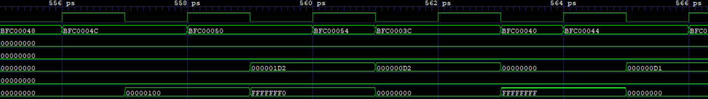
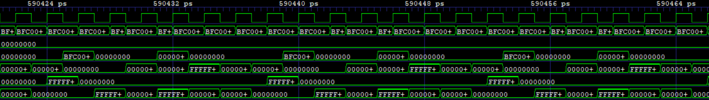
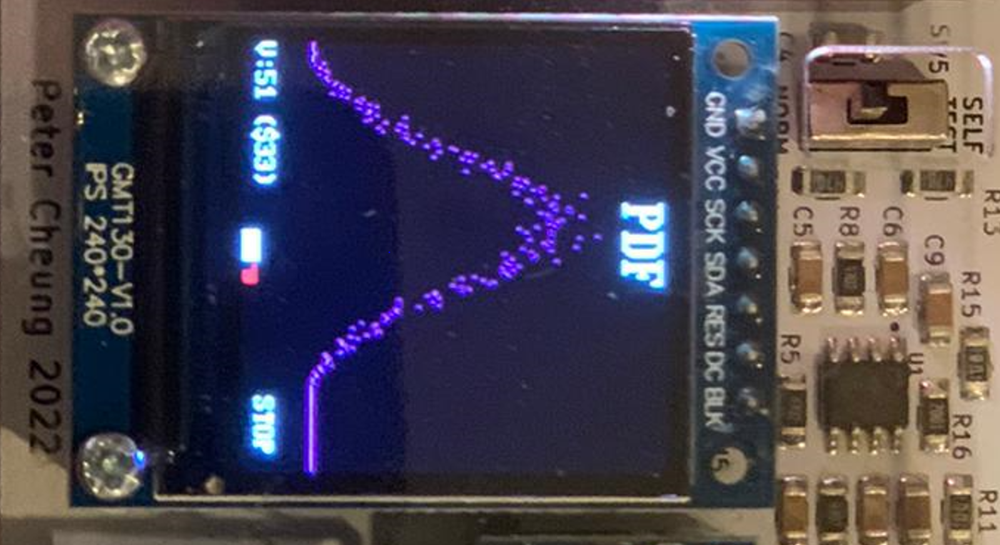
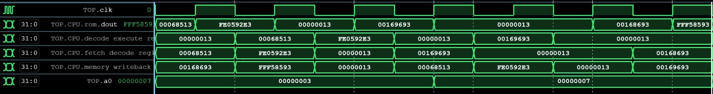
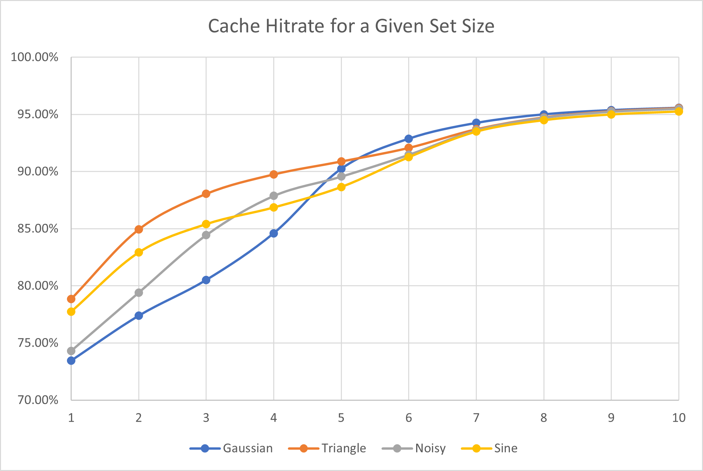

# 
**IAC RISC-V**

---
## 
 **RISC-V Design - 2nd year EIE IAC coursework** 

---
# Stretch Goal 2: Cached RV32I Design - Joint Statement 

- [**IAC RISC-V**](#iac-risc-v)
  - [ **RISC-V Design - 2nd year EIE IAC coursework** ](#-risc-v-design---2nd-year-eie-iac-coursework-)
- [Stretch Goal 2: Cached RV32I Design - Joint Statement](#stretch-goal-2-cached-rv32i-design---joint-statement)
  - [**DESIRED BEHAVIOUR**](#desired-behaviour)
  - [**IMPLEMENTATION**](#implementation)
    - [Hardware:](#hardware)
    - [Hardware Design Issues:](#hardware-design-issues)
    - [Addressing this](#addressing-this)
    - [Issues with this implementation:](#issues-with-this-implementation)
    - [Software:](#software)
  - [**Result**](#result)
    - [PDF Program Running Waveforms](#pdf-program-running-waveforms)
      - [Setup Section, Sets each value in registers to 0](#setup-section-sets-each-value-in-registers-to-0)
      - [End of Waveform Outputing each register value to a0](#end-of-waveform-outputing-each-register-value-to-a0)
      - [Vbuddy Displayed Output](#vbuddy-displayed-output)
    - [F1 Program Running Waveforms](#f1-program-running-waveforms)
      - [F1 Program Waveform](#f1-program-waveform)
    - [Hitrate Calculation](#hitrate-calculation)

## **DESIRED BEHAVIOUR**

Cache is a small, fast memory that stores frequently used data to improve the performance of a computer or device. It is typically located on the processor chip or on a separate chip close to the processor, and is used to quickly access data that has been recently used. Cache memory is divided into different levels, each with its own size and speed, and is used in many different types of devices to improve the performance of applications and reduce access time to data.

However, when implemented within our processor, it will not improve performance. This is because the simulation does not consider the timing of RAM read and write speeds, which can affect performance in a real CPU. In a real system, these operations may take multiple cycles to complete due to inherent hardware speed limitations.

---
## **IMPLEMENTATION**

To implement cache we first decided that we would create a simple version that was directly mapped, and had a simple write through cache to RAM. the steps we took:

1. Define Memory Array
2. Adding Hit Detection
3. Add Miss Dectection
4. Output To Correct Wires

### Hardware: 

We created a new component called cache. The cache goes around the RAM, and when a hit is detected, the output of the cache component is set to the cached value instead of being read from the RAM. In the other case the output of the component is directly set to the value as stored in the RAM, while setting up pins to write this value to the cache to exploit temporal locality in case of future reads.

### Hardware Design Issues:

Initially, our cache was both reading and writing asynchronously. We though this was possible because the cache would never be both writing and reading at the same time, as either we would have a hit, or a miss. For the former case, we would simply be reading from the cache and in the latter case, we would be writing to the cache the value at the output pin of the RAM.

### Addressing this

To resolve the above issues, we added a syncronous component to the cache. An asynchronous part remains, writing the output of the Data Memory to the output of the RAM, but asynchronously, we are also writing to the cache.

### Issues with this implementation:

Our implementation only supports directly mapped cache. This means our cache cannot exploit spatial locality.

### Software: 

We wanted to evaluate the performance of our pipeline. To do this, we print to the output when there is a hit, and when there is a miss. To do this, first, we needed to implement a flag that would deactivate the cache when a memory operation was not taking place. This is important because otherwise the Data Memory fulfils superfluous read operation, making the cache store values which are not actually necessary. To do this, we implemented a flag which is true when we a performing a Data Memory operation (store or load), by checking the value of the opcode.

The result is that we have "hit" displayed when an actual cache hit occurs and "miss" when the cache has to lookup a value in the RAM. "Mrs Clock" means "Miss Clock", these jokes are very funny, and represent when a write to the cache after miss or a RAM storage operation actually takes place.

The `run.sh` file was modified to write the output of the program to a text file named `out.txt` a which is opened by a python script which counts the number of occurances of the words "miss" and "hit", then calculated the hitrate as $\frac{\text{hit}}{\text{hit }+\text{ miss}}$ and prints it. 

The execution of the script is halted if the word `error` is found in the program output. This could happen, for instance, if the `VBUDDY` flag in the testbench is defined, but the vBuddy is not connected. Another safeguard was put in place so that, should not data memory operation take place, the script does not attempt to divide by 0 but instead prints that no data memory operation took place.

---

## **Result**
### PDF Program Running Waveforms
#### Setup Section, Sets each value in registers to 0

#### End of Waveform Outputing each register value to a0

#### Vbuddy Displayed Output

### F1 Program Running Waveforms
#### F1 Program Waveform

The waveform illustrates the movement of instructions from one stage to another and demonstrates that the register a0 is responsible for keeping track of the lights. The program functions correctly in the cached version of the CPU.

### Hitrate Calculation

Using the python script described above, it was possible to calculate the hitrate for the different programs, with different set sizes.

One intersting observation that can be made is that, for smaller set sizes, the hitrate depends on the program, but as set size increases, the hitrates converges towards 95.95%, as the programming starts to matter less and less for the hitrate.

