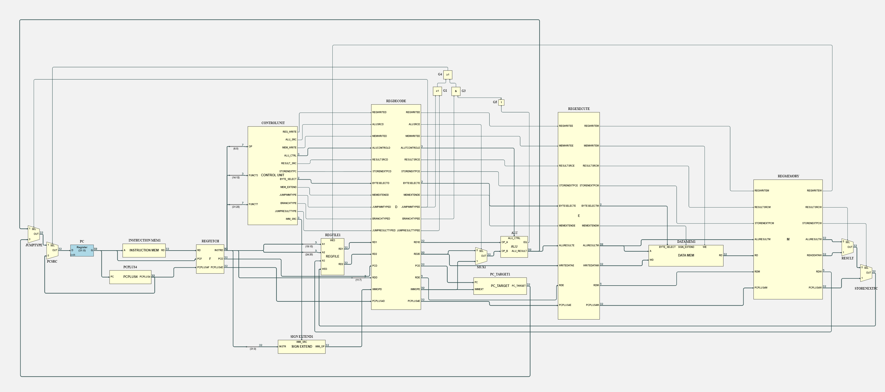
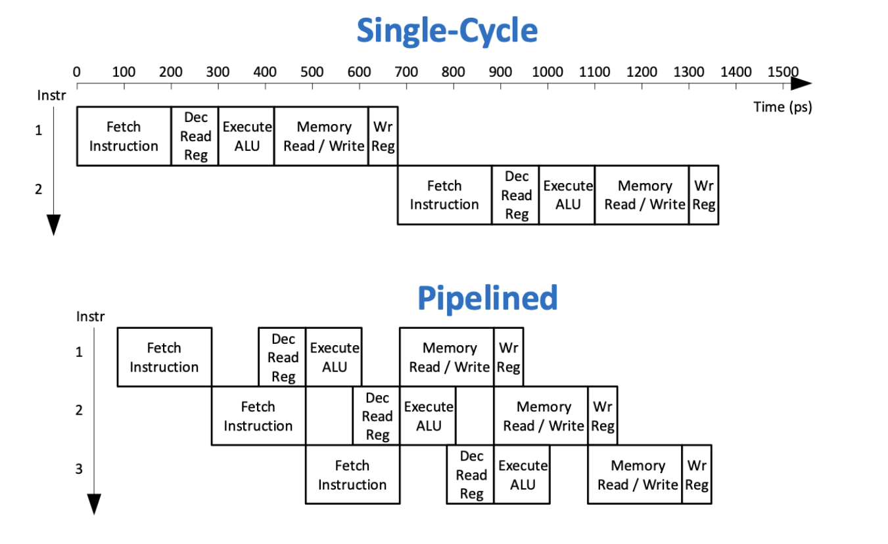
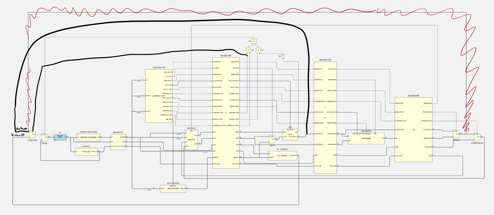
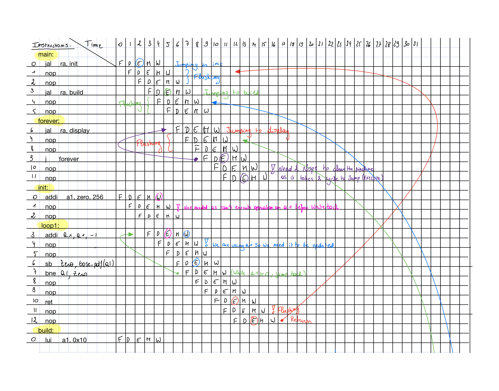
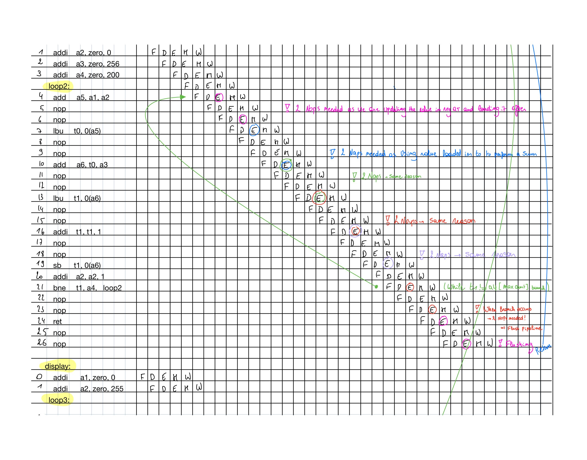
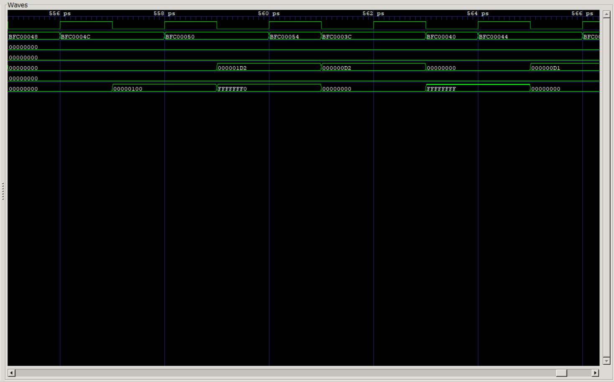
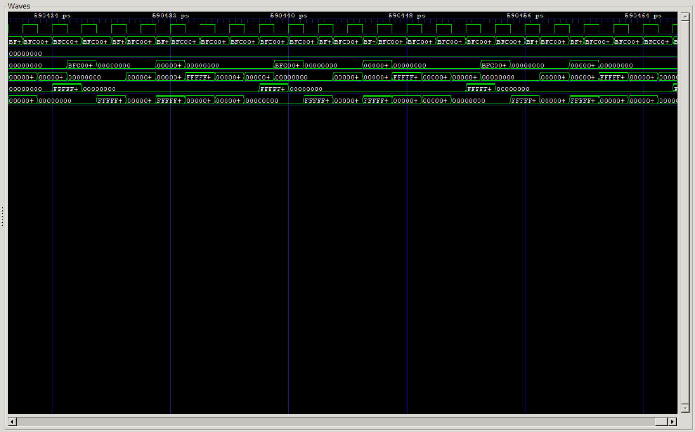

# 
**IAC RISC-V**

---
## 
 **RISC-V Design - 2nd year EIE IAC coursework** 

---
## **Pipelined RV32I Design - Joint Statement**

- [**IAC RISC-V**](#iac-risc-v)
  - [ **RISC-V Design - 2nd year EIE IAC coursework** ](#-risc-v-design---2nd-year-eie-iac-coursework-)
  - [**Pipelined RV32I Design - Joint Statement**](#pipelined-rv32i-design---joint-statement)
  - [**High Level Description**](#high-level-description)
  - [**IMPLEMENTATION**](#implementation)
    - [**Hardware changes**](#hardware-changes)
      - [**Early Hardware Design Issues**](#early-hardware-design-issues)
      - [**Fixing Process**](#fixing-process)
      - [**Addition of Control Signals \& Logic**](#addition-of-control-signals--logic)
      - [**Issues with this implementation**](#issues-with-this-implementation)
    - [**Software**](#software)
      - [**Debugging**](#debugging)
      - [**Software Design**](#software-design)
  - [**Results**](#results)
    - [F1 assembly:](#f1-assembly)
    - [PDF assembly:](#pdf-assembly)

---
## **High Level Description**
The desired behavior of our pipeline CPU is to efficiently execute instructions by overlapping the execution of multiple instructions in the pipeline. This allows the CPU to achieve high performance by reducing the amount of time spent waiting for instructions to complete. Each stage takes one clock cycle. Multiple instructions are executed at the same time, but progressing at different stages. Therefore in theory, we could be executing instructions over 3 times faster.

---
## **IMPLEMENTATION**

### **Hardware changes**
  * Divide the microarchitecture in 5 stages: 
     1. Fetch
     2. Decode 
     3. Execute 
     4. Memory 
     5. Writeback
   
  * Insert registers between each stage 

  * Register write occurs on the falling edge; data can be written in the first half cycle and read back in the second half of the cycle for use in a subsequent instruction.
  
  * Keep same control unit signals as single-processor, but all the control signals MUST be pipelined so that they are as delayed as data signals.
  
  * Additionally, to facilitate debugging, the delayed instruction is passed to all registers, so that one can easily ascertain which instruction is in which pipeline stage.

#### **Early Hardware Design Issues**

In the early stages of the implementation process, some potential issues were highlighted:

The `PCsrc` control signal is used to select if the next `PC` value is set to `PC + 4` (standard incrementation), or if it is a jump operation (this includes branch instructions).

The issue arises from the single-cycle CPU design. The Control Unit is made of a single block in which the `EQ` flag is driven by the ALU, and in turn indicates if jumping with `bne`, for instance, should occur.

The issue is, with pipelining, the decision whether to jump or not would take place during the decode stage, but the jump criterion is only evaluated during the execute stage.

#### **Fixing Process**

There are two possible ways to resolve this issue:

1. Delay the `funct3` input within the decode block for a cycle to wait for the `EQ` signal from the `ALU`, to then decide if jumping should occur.
2. Remove the `EQ` input signal and check if `PCsrc` should be high within the Execute block rather than Decode

We decided that we should go with the second option, as this would simply the overall top sheet design, as well as prevent confusion within the Decode block as a result of the mixing of synchronous and asynchronous logic. Additionally, this the way P.Cheung addressed the issue in his schematics.

#### **Addition of Control Signals & Logic**
This modification required the addition of three new control signals: 

* `BranchType` 
* `JumpResultType` 
* `JumpImmType`.  
  
These would be used in the two multiplexers controlling `PC`.

The two Jump signals would set the `PCsrc` to high, as they are guaranteed to change the next `PC` value, and finally BranchType would be compared against `EQ` to check whether `PCsrc` should be high.

#### **Issues with this implementation**

Although this implementation allows for the pipelined CPU to work and complete the PDF code, it makes it very difficult to implement the other Branch instructions as each branch instruction would require a seperate control signal.

---
### **Software**
One way to avoid data hazards in a pipelined CPU is to use the `nop` (no operation) instruction. The nop instruction is a special instruction that does not perform any operation, but takes up a slot in the pipeline. When a data hazard occurs, the nop instruction can be inserted into the pipeline to fill the empty slot, allowing the pipeline to continue processing instructions without stalling. It is important to carefully consider the placement of nop instructions, as inserting too many nop instructions can increase the overall execution time of the program. We used the method described below to insert `nop` when needed: 

  * Begin by iterating through the instructions in the program in order.
  * For each instruction, check if it has any data dependencies on previous instructions. If it does, insert a nop instruction before it to avoid a data hazard.
  * I the instruction is a jump/branch type instruction, remember to add `nop` to flush the pipeline
  * Repeat this process until all instructions have been processed and all data hazards have been avoided.

#### **Debugging**

Firstly, as a precautionary measure, NOP was added five times between each instruction. This guaranteed that no pipeline issues could cause problems. However, the PDF program did not function. This could only be linked to an issue with the instruction execution itself.

Testing each instruction in turn, we found there were issues with `jalr`. The issue was linked to the input of the `jumpType` MUX (see illustration below). The signal was being fed by a component in the Writeback stage, while the control signal was being driven by components in the Execute stage. The consequence was jumping to a different location than the label.

After this fix, we read through the program, removing as many NOPs as possible. This made the program run much faster, and most importantly, we got the same output as the non pipelined version.

#### **Software Design**
We developed a method to determine when nop instructions are necessary to avoid hazards in the pipeline while minimizing their use and maintaining a clean program. The images below provide a full tracing of the program, including the steps and explanations for the use of nop instructions. Each stage and instruction is shown in detail.

* *Key*:
  * F = Fetch stage 
  * D = Decode stage 
  * E = Execute stage 
  * M = Memory stage 
  * W = Writeback stage 

To make the tracing more clear and concise, each subroutine begins at cycle 0. This allows us to use a thinner table while still being able to accurately trace the program. The numbers at the top of the table and the numbers on the left side of the table help us see the different stages of an instruction as it moves through time and when each stage is executed.

## **Results**
### F1 assembly: 
The waveform illustrates the movement of instructions from one stage to another and demonstrates that the register a0 is responsible for keeping track of the lights. The program functions correctly in the pipeline version of the CPU. 

### PDF assembly: 

The first waveform shows the beginning and end of the Gaussian curve. It initially loads zero into every register, then in the second waveform, we can see the data being tranfered from each register into the display register a0. The program operates as intended in the pipeline version of the CPU.

