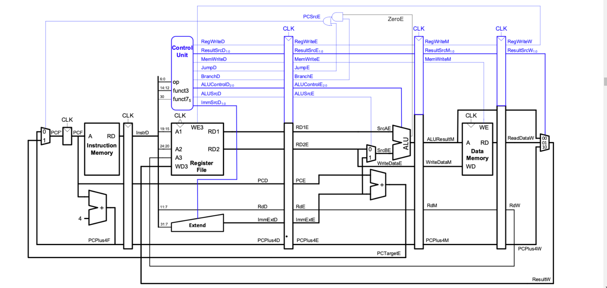
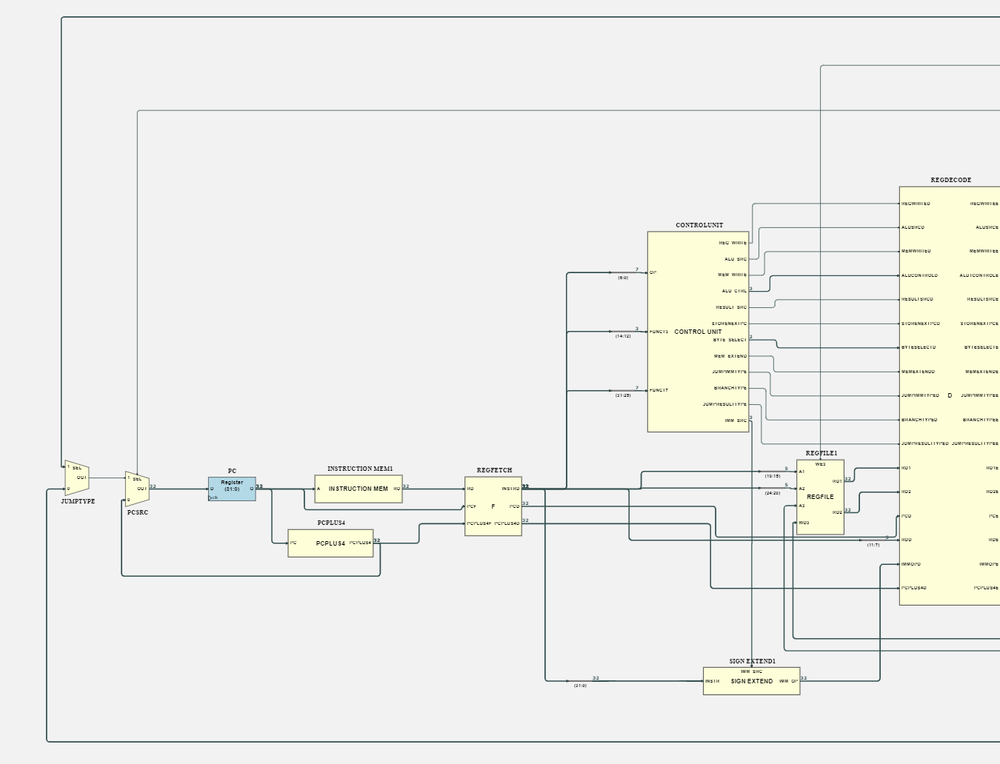
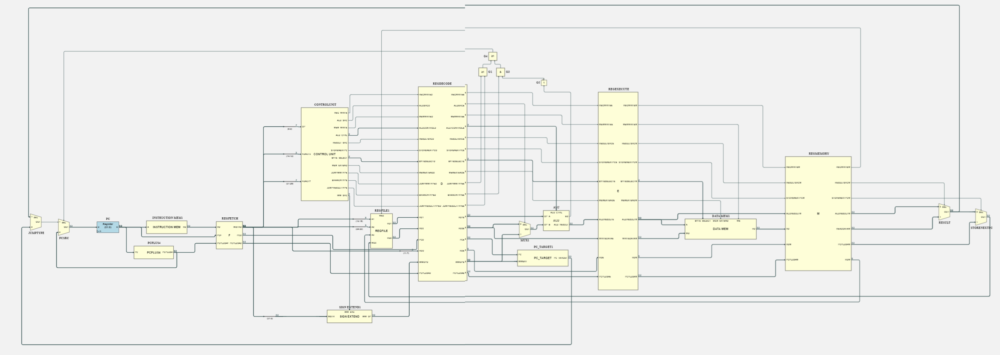

# <center>**IAC_RISC-V**</center>
---
## <center> **RISC-V Design - 2nd year EIE IAC coursework** </center>
---


# Stretch Goal 1: Pipelined RV32I Design

- [**IAC\_RISC-V**](#iac_risc-v)
  - [ **RISC-V Design - 2nd year EIE IAC coursework** ](#-risc-v-design---2nd-year-eie-iac-coursework-)
- [Stretch Goal 1: Pipelined RV32I Design](#stretch-goal-1-pipelined-rv32i-design)
  - [**DESIRED BEHAVIOUR**](#desired-behaviour)
  - [**IMPLEMENTATION**:](#implementation)
    - [Hardware:](#hardware)
    - [Software:](#software)
  - [](#)
  - [**ALLOCATION OF TASKS**:](#allocation-of-tasks)
  - [**Branch Protection Policy**](#branch-protection-policy)
  - [**Directory Format**](#directory-format)




## <ins>**DESIRED BEHAVIOUR**</ins>

1. Upon receving a trigger the routine is executed
2. The `a0` drives the led bar on the *VBuddy* turning on each light every second
3. Once all 8 lights are on a random amount of time elapses before they all turn off
4. The testbench uses *VBuddy* methods to measure how long it takes the user to press the button after the lights turn off
5. Make the instruction work in parallel instead of series. Allow the CPU to be **faster** because **each stage** is now a pipeline stage taking
**one clock cycle**. Multiple instructions are executed at the same time, but progressing at different stages. Therefore in theory, we could be executing instructions over 3 times
faster.


---
## <ins>**IMPLEMENTATION**</ins>: 

### Hardware: 
  1. Divide the microarchitecture in 5 stages: 
     1. Fetch
     2. Decode 
     3. Execute 
     4. Memory 
     5. Writeback
  2. Insert registers between each five stages 
      * <ins>Consequence</ins>: Create signals with the same purpose but for different instructions.
  3. Make the registers **WriteBack** happen on the **FALL EDGE** &rarr; Data can be written in the
first half cycle and read back in the second half of the cycle for use in a
subsequent instruction.
1. Keep same control unit signals as single-processor **. /!\ .** All the control signals MUST be pipelined so that they arrive in synchrony to the datapath **. /!\ .**
    1. Split up PC and ROM components 
Additionally, to facilitate debugging, the delayed instruction is passed to all registers, so that one can easily ascertain which instruction is in which pipeline stage.
---
### Software: 
   1. By inspection, analyse the software program and insert `NOP` (`addi, zero, zer0, 0` &rarr; *do nothing*) when needed: 
       *  If two S/I/R-Type instruction are one after the other and the destination register of the first instruction is used as a source the register for the seocnd instruction 
       *  When a Branch instruction occurs the fetched instructions after branch but before branch occurs must be **flushed** if the branch happens. 

---

 

---
## <ins>**ALLOCATION OF TASKS**</ins>: 
* Luigi Rinaldi, Diego Van Overberghe, Ezra Reich: 
  * Task:  
    * Implement the various registers and change the Control Unit signals accordingly. 
    * Add logic gates and multiplexors (See circuit diagram above)
* Corey O'Malley: 
  * Task: 
    * The testbench and verification of the design working via gtkWave and Vbuddy (where appropriate).


---

## **Branch Protection Policy**

The `main` branch is protected an cannot be directly pushed to. This is to attempt to protect production code from untested development code.

When team members approve a pull request from `develop` into `main`, they are indicating that they are reasonably confident that the code in question has been tested and is working as expected. This also helps familiarise team members with others' code.
On the other and, if a pull request is opened merging a feature branch into the `develop` branch, approval incites team members to read through new code to ensure they remain familiar with the codebase.

---
## **Directory Format**

The main branch is protected and the only way to modify it is by submitting a pull request which must be approved by at least two other contributors.

The develop branch looks as follows:

Notice that obj_dir, and the *.vcd files are not included in the repository.

```
REAMDE.md this file
Assembler P Cheung recommended assembler
F1_asm and other code
programs machine code (.mem) that will be run with the cpu exe.sh comman d
RTL ━━━━━┳━ exe.sh build to full CPU testbench, and when entering a parameter (ie. hello), moves hello.mem from programs folder to instruction.mem in the CPU folder.
         ┣━ CPU ━━━━━┳━ CPU.sv
         ┃           ┣━ PC.sv
         ┃           ┣━ CONTROL.sv
         ┃           ┣━ INSTR_MEM.sv
         ┃           ┣━ ...
         ┃           ┣━ CPU_tb.cpp
         ┃           ┣━ Vbuddy.cpp
         ┃           ┣━ Vbuddy.cfg
         ┃           ┣━ README.md Explaining the use of the component
         ┃           ┗━ images ━┳━ CPU.png Screaming Snake Case
         ┃                      ┗━ ...
         ┃
         ┣━ PC ━━━━━━┳━ PC.sv
         ┃           ┣━ PC_tb.cpp
         ┃           ┣━ Vbuddy.cpp
         ┃           ┣━ Vbuddy.cfg    
         ┃           ┣━ README.md 
         ┃           ┗━ images ━┳━ PC.png
         ┃                      ┗━ ...
         ┗━ CONTROL ━┳━ CONTROL.sv
                     ┣━ CONTROL_tb.cpp
                     ┣━ Vbuddy.cpp
                     ┣━ Vbuddy.cfg
                     ┣━ README.md
                     ┗━ images ━┳━ CONTROL.png
                                ┗━ ...
.
.
.
and so on
```

and so on...

This allows individual components to be tested individually with their own testbenches. This allows continuous debugging of components. When a component is updated it must be updated in the component folder first, then tested and finally copied to the main CPU folder.
