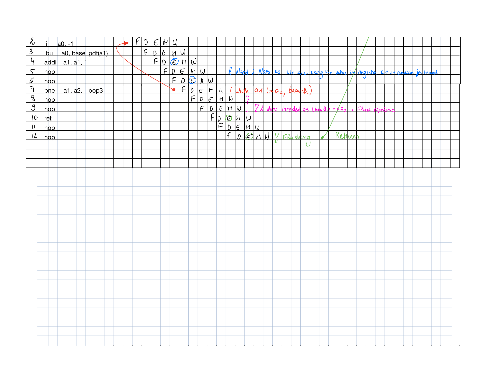

# <center>**IAC_RISC-V**</center>
---
## <center> **RISC-V Design - 2nd year EIE IAC coursework** </center>
---


# Stretch Goal 1: Pipelined RV32I Design

- [**IAC\_RISC-V**](#iac_risc-v)
  - [ **RISC-V Design - 2nd year EIE IAC coursework** ](#-risc-v-design---2nd-year-eie-iac-coursework-)
- [Stretch Goal 1: Pipelined RV32I Design](#stretch-goal-1-pipelined-rv32i-design)
  - [**DESIRED BEHAVIOUR**](#desired-behaviour)
  - [**IMPLEMENTATION**](#implementation)
    - [Hardware](#hardware)
    - [Early Hardware Design Issues](#early-hardware-design-issues)
    - [Addressing this](#addressing-this)
    - [Issues with this implementation](#issues-with-this-implementation)
    - [Software](#software)
    - [Debugging](#debugging)
    - [Software Design](#software-design)
  - [**ALLOCATION OF TASKS**](#allocation-of-tasks)
  - [**Branch Protection Policy**](#branch-protection-policy)
  - [**Directory Format**](#directory-format)


## **DESIRED BEHAVIOUR**

1. Upon receving a trigger the routine is executed
2. The `a0` drives the led bar on the *VBuddy* turning on each light every second
3. Once all 8 lights are on a random amount of time elapses before they all turn off
4. The testbench uses *VBuddy* methods to measure how long it takes the user to press the button after the lights turn off
5. Make the instruction work in parallel instead of series. Allow the CPU to be **faster** because **each stage** is now a pipeline stage taking
**one clock cycle**. Multiple instructions are executed at the same time, but progressing at different stages. Therefore in theory, we could be executing instructions over 3 times
faster.


---
## **IMPLEMENTATION**

### Hardware 
  1. Divide the microarchitecture in 5 stages: 
     1. Fetch
     2. Decode 
     3. Execute 
     4. Memory 
     5. Writeback
  2. Insert registers between each stage 
  3. Register write occurs on the falling edge; data can be written in the
first half cycle and read back in the second half of the cycle for use in a
subsequent instruction.
1. Keep same control unit signals as single-processor, but all the control signals MUST be pipelined so that they are as delayed as data signals.
    1. Split up PC and ROM components 
Additionally, to facilitate debugging, the delayed instruction is passed to all registers, so that one can easily ascertain which instruction is in which pipeline stage.


### Early Hardware Design Issues

In the early stages of the implementation process, some potential issues were highlighted:

THe `PCsrc` control signal is used to select if the next `PC` value is set to `PC + 4` (standard incrementation), or if it is a jump operation (this includes branch instructions).

The issue arises from the single-cycle CPU design. The Control Unit is made of a single block in which the `EQ` flag is driven by the ALU, and in turn indicates if jumping with `bne`, for instance, should occur.

The issue is, with pipelining, the decision whether to jump or not would take place during the decode stage, but the jump criterion is only evaluated during the execute stage.

### Addressing this

There are two possible ways to resolve this issue:

1. Delay the `func3` input within the decode block for a cycle to wait for the `EQ` signal from the `ALU`, to then decide if jumping should occur.
2. Remove the `EQ` input signal and check if `PCsrc` should be high within the Execute block rather than Decode

We decided that we should go with the second option, as this would simply the overall top sheet design, as well as prevent confusion within the decode block as a result of the mixing of synchronous and asynchronous logic. Additionally, this the way P.Cheung addressed the issue in his schematics.

This modification required the addition of three new control signals: `BranchType`, `JumpResultType` and `JumpImmType`. These would be used in the two multiplexers controlling `PC`.

The two Jump signals would set the `PCsrc` to high, as they are guaranteed to change the next `PC` value, and finally BranchType would be compared against `EQ` to check whether `PCsrc` should be high.

### Issues with this implementation

Although this implementation allows for the pipelined CPU to work and complete the PDF code, it makes it very difficult to implement the other Branch instructions as each branch instruction would require a seperate control signal.


---
### Software
   1. By inspection, analyse the software program and insert `NOP` (`addi, zero, zer0, 0` &rarr; *do nothing*) when needed: 
       *  If two S/I/R-Type instruction are one after the other and the destination register of the first instruction is used as a source the register for the seocnd instruction 
       *  When a Branch instruction occurs the fetched instructions after branch but before branch occurs must be **flushed** if the branch happens. 

---


### Debugging

Firstly, as a precautionary measure, NOP was added five times between each instruction. This guaranteed that no pipeline issues could cause problems. However, the pdf program did not function. This could only be linked to an issue with the instruction execution itself.

Testing each instruction in turn, we found there were issues with `jalr`. The issue was linked to the input of the `jumpType` MUX (see illustration below). The signal was being fed by a component in the Writeback stage, while the control signal was being driven by components in the Execute stage. The consequence was jumping to a different location than the label.


After this fix, we read through the program, removing as many NOPs as possible. This made the program run much faster, and most importantly, we got the same output as the non pipelined version.

---
### Software Design
To minimize the use of nop instructions, we developed a method to determine when they are necessary for the program to run correctly while maintaining a clean and hazard-free pipeline. The images below provide a full tracing of the program, showing and explaining why we used nop instructions to avoid hazards. Each stage and instruction is shown step by step.




* Key:
  * F = Fetch stage 
  * D = Decode stage 
  * E = Execute stage 
  * M = Memory stage 
  * W = Writeback stage 

To make the tracing more clear and concise, each subroutine begins at cycle 0. This allows us to use a thinner table while still being able to accurately trace the program. The numbers at the top of the table and the numbers on the left side of the table help us see the different stages of an instruction as it moves through time and when each stage is executed.

---
## **ALLOCATION OF TASKS**
* Luigi Rinaldi, Diego Van Overberghe, Ezra Reich: 
  * Task:  
    * Implement the various registers and change the Control Unit signals accordingly. 
    * Add logic gates and multiplexors (See circuit diagram above)
* Corey O'Malley: 
  * Task: 
    * The testbench and verification of the design working via gtkWave and Vbuddy (where appropriate).


---

## **Branch Protection Policy**

The `main` branch is protected an cannot be directly pushed to. This is to attempt to protect production code from untested development code.

When team members approve a pull request from `develop` into `main`, they are indicating that they are reasonably confident that the code in question has been tested and is working as expected. This also helps familiarise team members with others' code.
On the other and, if a pull request is opened merging a feature branch into the `develop` branch, approval incites team members to read through new code to ensure they remain familiar with the codebase.

---
## **Directory Format**

The main branch is protected and the only way to modify it is by submitting a pull request which must be approved by at least two other contributors.

The develop branch looks as follows:

Notice that obj_dir, and the *.vcd files are not included in the repository.

```
REAMDE.md this file
Assembler P Cheung recommended assembler
F1_asm and other code
programs machine code (.mem) that will be run with the cpu exe.sh comman d
RTL ━━━━━┳━ exe.sh build to full CPU testbench, and when entering a parameter (ie. hello), moves hello.mem from programs folder to instruction.mem in the CPU folder.
         ┣━ CPU ━━━━━┳━ CPU.sv
         ┃           ┣━ PC.sv
         ┃           ┣━ CONTROL.sv
         ┃           ┣━ INSTR_MEM.sv
         ┃           ┣━ ...
         ┃           ┣━ CPU_tb.cpp
         ┃           ┣━ Vbuddy.cpp
         ┃           ┣━ Vbuddy.cfg
         ┃           ┣━ README.md Explaining the use of the component
         ┃           ┗━ images ━┳━ CPU.png Screaming Snake Case
         ┃                      ┗━ ...
         ┃
         ┣━ PC ━━━━━━┳━ PC.sv
         ┃           ┣━ PC_tb.cpp
         ┃           ┣━ Vbuddy.cpp
         ┃           ┣━ Vbuddy.cfg    
         ┃           ┣━ README.md 
         ┃           ┗━ images ━┳━ PC.png
         ┃                      ┗━ ...
         ┗━ CONTROL ━┳━ CONTROL.sv
                     ┣━ CONTROL_tb.cpp
                     ┣━ Vbuddy.cpp
                     ┣━ Vbuddy.cfg
                     ┣━ README.md
                     ┗━ images ━┳━ CONTROL.png
                                ┗━ ...
.
.
.
and so on
```

and so on...

This allows individual components to be tested individually with their own testbenches. This allows continuous debugging of components. When a component is updated it must be updated in the component folder first, then tested and finally copied to the main CPU folder.
