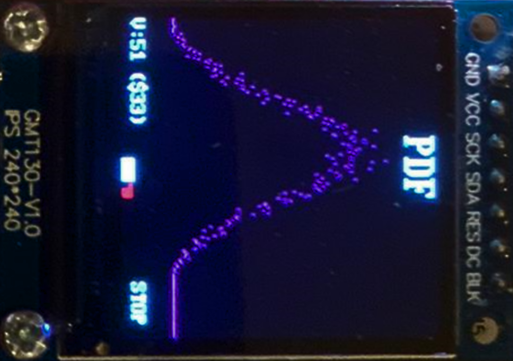

# 
**IAC_RISC-V**

---
## 
 **RISC-V Design - 2nd year EIE IAC coursework** 

---
# Stretch Goal 1: Pipelined RV32I Design

- [**IAC\_RISC-V**](#iac_risc-v)
  - [ **RISC-V Design - 2nd year EIE IAC coursework** ](#-risc-v-design---2nd-year-eie-iac-coursework-)
- [Stretch Goal 1: Pipelined RV32I Design](#stretch-goal-1-pipelined-rv32i-design)
  - [**DESIRED BEHAVIOUR**](#desired-behaviour)
  - [**IMPLEMENTATION**:](#implementation)
    - [Hardware:](#hardware)
    - [Software:](#software)
  - [**RESULT**](#result)
  - [**ALLOCATION OF TASKS**:](#allocation-of-tasks)
  - [**Branch Protection Policy**](#branch-protection-policy)
  - [**Directory Format**](#directory-format)

## **DESIRED BEHAVIOUR**

---
## **IMPLEMENTATION**

### Hardware: 

### Early Hardware Design Issues:

### Addressing this

### Issues with this implementation:

---
### Software: 

---

### Debugging

---

## Result
### PDF Program Running Waveforms
#### Setup Section, Sets each value in registers to 0

#### End of Waveform Outputing each register value to a0

#### Vbuddy Displayed Output
