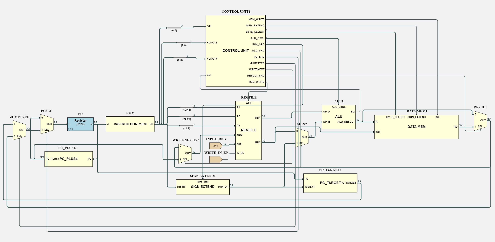

# Control Unit

- [Control Unit](#control-unit)
    - [Instruction types](#instruction-types)
    - [Implemented instructions](#implemented-instructions)
      - [`addi`](#addi)
      - [`bne`](#bne)
      - [`lw`](#lw)
      - [`sw`](#sw)
      - [`slli`](#slli)
      - [`jal`](#jal)
      - [`jalr`](#jalr)
      - [`sb`](#sb)
      - [`lbu`](#lbu)
      - [`lui`](#lui)
      - [`andi`](#andi)
      - [`add`](#add)
      - [`sub`](#sub)
      - [`and`](#and)
      - [`slt`](#slt)
      - [`sll`](#sll)
      - [Opcode and funct mapping](#opcode-and-funct-mapping)
    - [First implementation](#first-implementation)
      - [Testing](#testing)
    - [Adding Data Memory Signals](#adding-data-memory-signals)
      - [Testing](#testing-1)
  - [Control Unit Refactor](#control-unit-refactor)
    - [Hardware changes](#hardware-changes)
    - [Testing](#testing-2)




### Instruction types

All instructions are part of a *Type* which identifies how they interpret the bits of the immediate.

Type     | Opcode                     | Description                                 | Implemented instructions | Shared Control Signals 
-------- | -------------------------- | ------------------------------------------- | ------------------------ | ---------------------- 
**`R`**  | `0110011`                  | Register to Register instructions           | `add`                    | Set `ResultSrc` to disable as we care about the ALU output.<br> Set `RegWrite` to enable as we want to write in the registers.</br>
**`I1`** | `0000011`                  | Load instructions that use 12-bit immediate | `lw`                     | Set `ImmSrc` to `Imm` to sign extend and concatenate with original.
**`I2`** | `0010011`                  | ALU instructions that use 12-bit immediate  | `addi` , `slli`          | Set `RegWrite` to enable writing to register <br> set `ImmSrc` to `Imm`. </br><br>Set `ALUsrc` to select `ImmOp` as second operand</br>
**`I3`** | `1100111`                  | Jump with 12-bit immediate                  | `jalr`                   | Set `ImmSrc` to `Imm` <br> Set `RegWrite` to enable writing to register </br><br> Set `AluCtrl` to SUM to make the alu complete an addition</br> <br> Set `ALUsrc` to select `ImmOp` as it will use this within the ALU</br> <br>Set `WriteNextPc` to make the current PC plus four be stored in a register</br><br>Set `JumpType` and `PCsrc` to enable to choose the correct next PC value</br>
**`S`**  | `0100011`                  | Store instruction with 12-bit immediate     | `sw`                     | Set `MemWrite` to enable as we are storing a word in the memory.<br> `ImmSrc` to `Store`.</br><br> `ResultSrc` to disable as we are bypassing the Data Memory Unit, using ALUResult.</br><br> Set `ALUsrc` to enable because we are always using `ImmExt`.</br><br>Set `ALUctrl` to `SUM_OP` to set the ALU to complete a sum operation.</br>
**`B`**  | `1100011`                  | Branch instructions with 13-bit immediate   | `bne`                    | Set `ImmSrc` to `Branch` as we use branch immediate. 
**`U`**  | `0010111` <br /> `0110111` | Upper immediate instructions                | None                     | None
**`J`**  | `1101111`                  | Jump instructions with 20-bit immediate     | `jal`                    | Only one instruction is implemented so no shared signals
### Implemented instructions
#### `addi`

Add immediate. Add the value of an immediate to the value of a register and store the result in another register.

Control Signal | Expected | Notes                |
 :-----------: | :------: | :------------------- |
`RegWrite`     | `1`      | None                 |
`ALUctrl`      | `000`    | SUM Mode             |
`ALUsrc`       | `1`      | Immediate Operation  |
`ImmSrc`       | `000`    | Immediate type I     |
`PCsrc`        | `0`      | No Jump              |
`JumpType`     | `x`      | No Jump              |
`MemWrite`     | `0`      | No Memory Write      |
`ResultSrc`    | `0`      | Reading ALU result   |
`WriteNextPC`  | `0`      | No Jump              |
`ByteSelect`   | `xx`     | No Byte Op           |
`MemExtend`    | `x`      | No Memo Op           |

#### `bne`

Branch not equal. If the operands from the previous instruction are not the same then change the PC to PC + the value of the immediate.

Control Signal | Expected | Notes                                               |
 :-----------: | :------: | :-------------------------------------------------- |
`RegWrite`     | `0`      | No Register Write                                   |
`ALUctrl`      | `xxx`    | ALU has built in equality check regardless of mode  |
`ALUsrc`       | `x`      | ALU bypassed                                        |
`ImmSrc`       | `011`    | Immediate type B                                    |
`PCsrc`        | `0 or 1` | Jump if `EQ` flag is set                            |
`JumpType`     | `0`      | Jump to immediate                                   |
`MemWrite`     | `0`      | No Memory Write                                     |
`ResultSrc`    | `x`      | Doesn't affect instruction execution                |
`WriteNextPC`  | `0`      | No PC write                                         |
`ByteSelect`   | `xx`     | No Byte Op                                          |
`MemExtend`    | `x`      | No Memo Op                                          |

#### `lw`

Load word. Load into a register the word at the address given by another register and offset by the immediate.

Control Signal | Expected | Notes                                            |
 :-----------: | :------: | :----------------------------------------------- |
`RegWrite`     | `1`      | Writing to Registers                             |
`ALUctrl`      | `000`    | SUM Mode                                         |
`ALUsrc`       | `1`      | Immediate Operation                              |
`ImmSrc`       | `000`    | Immediate type I                                 |
`PCsrc`        | `0`      | No Jump                                          |
`JumpType`     | `x`      | No Jump                                          |
`MemWrite`     | `0`      | No Memory Write                                  |
`ResultSrc`    | `1`      | Data Memory Read                                 |
`WriteNextPC`  | `0`      | No PC write                                      |
`ByteSelect`   | `00`     | Word                                             |
`MemExtend`    | `x`      | Doesn't matter since entire word is being loaded |

#### `sw`

Store Word, this is the instruction to save data from a register into a given address of the data memory, this is done by controlling the Write Enable section of the data_memory and taking the output from the regfile at RD2 as the data and the data from RD1 + Imm to get the address to write the data to.

Control Signal | Expected | Notes                                |
 :-----------: | :------: | :----------------------------------- |
`RegWrite`     | `0`      | No Register Write                    |
`ALUctrl`      | `000`    | SUM Mode                             |
`ALUsrc`       | `1`      | Immediate Operation                  |
`ImmSrc`       | `010`    | Immediate type S                     |
`PCsrc`        | `0`      | No Jump                              |
`JumpType`     | `x`      | No Jump                              |
`MemWrite`     | `1`      | Writing to Data Memory               |
`ResultSrc`    | `x`      | Doesn't affect instruction execution |
`WriteNextPC`  | `0`      | No PC Write                          |
`ByteSelect`   | `10`     | Byte                                 |
`MemExtend`    | `x`      | Storing, no sign extension           |
#### `slli`

Shift logical left immediate, this instruction shifts the contents of a given register left by the amount specified in the immediate. 

Control Signal | Expected | Notes               |
 :-----------: | :------: | :------------------ |
`RegWrite`     | `1`      | Writing to Register |
`ALUctrl`      | `100`    | SLL Mode            |
`ALUsrc`       | `1`      | Immediate Operation |
`ImmSrc`       | `000`    | Immediate type I    |
`PCsrc`        | `0`      | No Jump             |
`JumpType`     | `x`      | No Jump             |
`MemWrite`     | `0`      | No Memory Write     |
`ResultSrc`    | `0`      | ALU Result Read     |
`WriteNextPC`  | `0`      | No PC Write         |
`ByteSelect`   | `xx`     | No Byte Op          |
`MemExtend`    | `x`      | No Memo Op          |


#### `jal`

This instructions changes the `PC` to `PC + ImmOP` and saves what would have been the next instruction to a given register.

Control Signal | Expected | Notes                                                           |
 :-----------: | :------: | :-------------------------------------------------------------- |
`RegWrite`     | `1`      | Write PC + 4 to Register                                        |
`ALUctrl`      | `xxx`    | ALU Bypassed                                                    |
`ALUsrc`       | `x`      | ALU Bypassed                                                    |
`ImmSrc`       | `100`    | Immediate type J                                                |
`PCsrc`        | `1`      | Jump                                                            |
`JumpType`     | `0`      | Jump to Immediate                                               |
`MemWrite`     | `0`      | No Memory Write                                                 |
`ResultSrc`    | `x`      | Doesn't affect instruction execution, PC + 4 has separate adder |
`WriteNextPC`  | `1`      | Write next PC to Register                                       |
`ByteSelect`   | `xx`     | No Byte Op                                                      |
`MemExtend`    | `x`      | No Memo Op                                                      |

#### `jalr`

This instruction changes the `PC` to the sum of a given register and the immediate. It then saves what would have been the next instruction address to another given register. The instructions is used to return from subroutines. To do this we need to add an additional mux that will allow us to set `PC` to the value of the output `Result`.

Control Signal | Expected | Notes                                                                                                           |
 :-----------: | :------: | :-------------------------------------------------------------------------------------------------------------- |
`RegWrite`     | `1`      | Although `RegWrite` is 1, most of the time, `jalr` is programmed to write to register `zero` which does nothing |
`ALUctrl`      | `000`    | SUM Mode                                                                                                        |
`ALUsrc`       | `1`      | Immediate Operation                                                                                             |
`ImmSrc`       | `000`    | Immediate type I                                                                                                |
`PCsrc`        | `1`      | Jump                                                                                                            |
`JumpType`     | `1`      | Jump to Register Value                                                                                          |
`MemWrite`     | `0`      | No Memory Write                                                                                                 |
`ResultSrc`    | `0`      | ALU Result Read                                                                                                 |
`WriteNextPC`  | `1`      | Although `RegWrite` is 1, most of the time, `jalr` is programmed to write to register `zero` which does nothing |
`ByteSelect`   | `xx`     | No Byte Op                                                                                                      |
`MemExtend`    | `x`      | No Memo Op                                                                                                      |

#### `sb`

This instruction stores the bottom 8 bits of a given register (`rs2`) into an address using byte addressing. The address is given by the register `rs1` offset by a 1 bit immediate 

Control Signal | Expected | Notes                           |
 :-----------: | :------: | :------------------------------ |
`RegWrite`     | `0`      |                                 |
`ALUctrl`      | `0`      | Sum rs1 with imm to get address |
`ALUsrc`       | `1`      | using ImmOp                     |
`ImmSrc`       | `010`    | Immediate type S                |
`PCsrc`        | `0`      |                                 |
`JumpType`     | `x`      |                                 |
`MemWrite`     | `1`      |                                 |
`ResultSrc`    | `x`      |                                 |
`WriteNextPC`  | `0`      |                                 |
`ByteSelect`   | `10`     | Byte                            |
`MemExtend`    | `x`      | Storing, no sign extension      |
#### `lbu`

Load unsigned byte, this loads a byte from a given address into a register `rd`, the value is 0 extended before being saved into the register. The address is given by the sum of the register `rs1` and a 12 bit immediate offset.

Control Signal | Expected | Notes                                                |
 :-----------: | :------: | :--------------------------------------------------- |
`RegWrite`     | `1`      | Save byte into register                              |
`ALUctrl`      | `000`    | Compute address by offsetting `rs1` by and immediate |
`ALUsrc`       | `1`      |                                                      |
`ImmSrc`       | `000`    |                                                      |
`PCsrc`        | `0`      |                                                      |
`JumpType`     | `x`      |                                                      |
`MemWrite`     | `0`      |                                                      |
`ResultSrc`    | `1`      | Save contents of data mem into register              |
`WriteNextPC`  | `0`      |                                                      |
`ByteSelect`   | `10`     | Byte                                                 |
`MemExtend`    | `0`      | Not sign extending (0 extending)                     |
#### `lui`

Load upper immediate, stores the 20 bits of the immediate as the most significant bits in a given register. `rd = {upimm, 12'b0}`

Control Signal | Expected | Notes                                      |
 :-----------: | :------: | :----------------------------------------- |
`RegWrite`     | `1`      |                                            |
`ALUctrl`      | `111`    | Take the Op2 and concatenate 12 bits of 0s |
`ALUsrc`       | `1`      | Using immediate                            |
`ImmSrc`       | `001`    | Using upper immediate                      |
`PCsrc`        | `0`      |                                            |
`JumpType`     | `x`      |                                            |
`MemWrite`     | `0`      |                                            |
`ResultSrc`    | `0`      | Take the ALU result                        |
`WriteNextPC`  | `0`      |                                            |
`ByteSelect`   | `xx`     | No Byte Op                                 |
`MemExtend`    | `x`      | No Memo Op                                 |
#### `andi`

And the contents of a register (`rs1`) with a sign extended 12 bit immediate and store the result in `rd`

Control Signal | Expected | Notes                        |
 :-----------: | :------: | :--------------------------- |
`RegWrite`     | `1`   | Write to destination register   |
`ALUctrl`      | `010` | Actually does the anding        |
`ALUsrc`       | `1`   | Use `ImmOp` as op2              |
`ImmSrc`       | `000` |                                 |
`PCsrc`        | `0`   |                                 |
`JumpType`     | `x`   |                                 |
`MemWrite`     | `0`   |                                 |
`ResultSrc`    | `0`   | Store result of ALU in register |
`WriteNextPC`  | `0`   |                                 |
`ByteSelect`   | `xx`  | No Byte Op                      |
`MemExtend`    | `x`   | No Memo Op                      |

#### `add`

Control Signal | Expected | Notes                 |
 :-----------: | :------: | :---------------------|
`RegWrite`     | `1`      | Write SUM to register |
`ALUctrl`      | `000`    | SUM Mode              |
`ALUsrc`       | `0`      | Register Operation    |
`ImmSrc`       | `xxx`    | No Immediate          |
`PCsrc`        | `0`      | No Jump               |
`JumpType`     | `x`      | No Jump               |
`MemWrite`     | `0`      | No Memory Write       |
`ResultSrc`    | `0`      | ALU Result Read       |
`WriteNextPC`  | `0`      |                       |
`ByteSelect`   | `xx`     | No Byte Op            |
`MemExtend`    | `x`      | No Memo Op            |

#### `sub`

Control Signal | Expected | Notes                 |
 :-----------: | :------: | :---------------------|
`RegWrite`     | `1`      | Write SUM to register |
`ALUctrl`      | `001`    | SUM Mode              |
`ALUsrc`       | `0`      | Register Operation    |
`ImmSrc`       | `xxx`    | No Immediate          |
`PCsrc`        | `0`      | No Jump               |
`JumpType`     | `x`      | No Jump               |
`MemWrite`     | `0`      | No Memory Write       |
`ResultSrc`    | `0`      | ALU Result Read       |
`WriteNextPC`  | `0`      |                       |
`ByteSelect`   | `xx`     | No Byte Op            |
`MemExtend`    | `x`      | No Memo Op            |

#### `and`

Control Signal | Expected | Notes                 |
 :-----------: | :------: | :---------------------|
`RegWrite`     | `1`      | Write SUM to register |
`ALUctrl`      | `010`    | SUM Mode              |
`ALUsrc`       | `0`      | Register Operation    |
`ImmSrc`       | `xxx`    | No Immediate          |
`PCsrc`        | `0`      | No Jump               |
`JumpType`     | `x`      | No Jump               |
`MemWrite`     | `0`      | No Memory Write       |
`ResultSrc`    | `0`      | ALU Result Read       |
`WriteNextPC`  | `0`      |                       |
`ByteSelect`   | `xx`     | No Byte Op            |
`MemExtend`    | `x`      | No Memo Op            |

#### `slt`

Control Signal | Expected | Notes                 |
 :-----------: | :------: | :---------------------|
`RegWrite`     | `1`      | Write SUM to register |
`ALUctrl`      | `101`    | SUM Mode              |
`ALUsrc`       | `0`      | Register Operation    |
`ImmSrc`       | `xxx`    | No Immediate          |
`PCsrc`        | `0`      | No Jump               |
`JumpType`     | `x`      | No Jump               |
`MemWrite`     | `0`      | No Memory Write       |
`ResultSrc`    | `0`      | ALU Result Read       |
`WriteNextPC`  | `0`      |                       |
`ByteSelect`   | `xx`     | No Byte Op            |
`MemExtend`    | `x`      | No Memo Op            |

#### `sll`

Control Signal | Expected | Notes                 |
 :-----------: | :------: | :---------------------|
`RegWrite`     | `1`      | Write SUM to register |
`ALUctrl`      | `100`    | SUM Mode              |
`ALUsrc`       | `0`      | Register Operation    |
`ImmSrc`       | `xxx`    | No Immediate          |
`PCsrc`        | `0`      | No Jump               |
`JumpType`     | `x`      | No Jump               |
`MemWrite`     | `0`      | No Memory Write       |
`ResultSrc`    | `0`      | ALU Result Read       |
`WriteNextPC`  | `0`      |                       |
`ByteSelect`   | `xx`     | No Byte Op            |
`MemExtend`    | `x`      | No Memo Op            |

#### Opcode and funct mapping

Instruction | opcode    | funct3 | funct7 | Type
----------- | :-------: | :----: | :----: | :---: 
*`addi`*    | `0010011` | `000`  | -      | I 
*`lw`*      | `0000011` | `010`  | -      | I 
*`bne`*     | `1100011` | `001`  | -      | B 

**TODO add other instructions**

### First implementation
A package was created to hold the type definitions common to the control logic blocks. This can be further extended to other modules in the CPU.
To have proper compilation the package (`types_pkg.sv` in this case) must be placed before the other files. In turn the `--top-module` flag must be specified in order to get the correct file names and structure, for example:
  ```sh
  verilator -Wall --cc --trace types_pkg.sv control_unit.sv --top-module control_unit --exe control_unit_tb.cpp
  ```

In the combinational logic block the outputs are initialized to zero so that they always hold that default value. This prevents rogue HIGH signals where not desired.

#### Testing

```
Running simulation
ADDI 
RegWrite: 1
ALUctrl: 00
ALUsrc: 1
ImmSrc: 000
PCsrc: 0

BNE false
RegWrite: 0
ALUctrl: 00
ALUsrc: 0
ImmSrc: 000
PCsrc: 0

BNE true
RegWrite: 0
ALUctrl: 00
ALUsrc: 0
ImmSrc: 011
PCsrc: 1
Simulation completed
```

Outputs are as intended.


### Adding Data Memory Signals

With the data memory additional signals needed to be added to allow for the control of storing data, as well as fetching the addresses correctly and reading data from the RAM. 

This includes the ImmSrc, MemWrite, ResultSrc and AluSrc signals

#### Testing

  Further testing was then added to make sure that the control signals for the `sw` instruction is correctly controlled, also a test program was tested which stored and loaded instructions to check proper operation of the data memory block. 

  During this an issue was found in which the Program Counter would loop after 32 instructions of a program, this was due to simple miss labeling of a parameter and as such, would set the program counter to have a size 2^5, this was then changed to a larger value to allow for more complex programs to be ran.

  **NOTE:** 
  *The size of the program counter is arbituary and as such needs to be kept to a reasonable value for simulation sizes but large enough to store instructions of large programs*


## Control Unit Refactor
The motivation for refactoring the control unit was the fact that depending on the instruction type, the CPU requires more or less of the instruction to correctly set the control signals.

For example, R-Type instructions need the following parts of the instruction to set control signals appropriately: 
`opcode: instr[6:0], func3: instr[14:12], funct7: instr[31:25]`.

On the other hand, B-Type instructions only require `opcode: instr[6:0]` to set the control signals.
### Hardware changes

A simple switch `case(instr)` could have been used, but this would have most likely quickly gotten out of hand, as this switch would list the encoding for every single RISC-V instruction implemented.

Instead, a nested switch approach will be used, where the top level switch checks the opcode, which sepecifies the instruction format, and nested switches for every instruction format so that the switch can check `funct3`, `funct7` or neither as required.

### Testing

Recall the usage of the control signals: 

- `RegWrite`: Enable writing to registers.
- `ALUctrl`: Select ALU operation mode.
- `ALUsrc`: Select whether ALU's second input comes from an immediate or a register.
- `ImmSrc`: Select Immediate type (I, R, S...).
- `PCsrc`: Select whether next PC comes from immediate or is current + 4.
- `JumpType` Sets the PC to the value of the Result Wire
- `MemWrite`: Enable writing to Data Memory
- `ResultSrc`: Select whether result source comes from ALU or Data Memory.
- `WriteNextPC`: When comines with `RegWrite`, writes PC + 4 to the REGFILE. Used in `jal`.

Each instruction will be tested in turn, with the control unit isolated from other CPU components.
