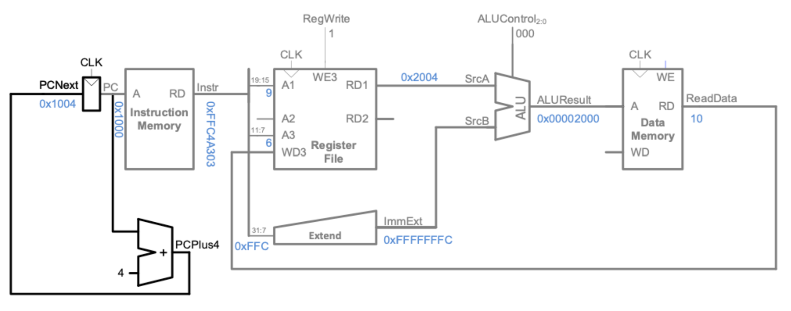

# Data memory

- [Data memory](#data-memory)
- [Design of Data Memory:](#design-of-data-memory)
  - [Which Control Signals](#which-control-signals)
  - [What Size](#what-size)
  - [How to test](#how-to-test)
  - [Issues With Data Memory:](#issues-with-data-memory)
  - [Design of Byte Addressing:](#design-of-byte-addressing)

In order to implement the instruction `lw` Load word as well as `sw` Store Word, a data memory RAM component needs to be added.

# Design of Data Memory:

## Which Control Signals

to do this, first of all some control signals needed to be added to allow for the correct selection of the Immediate type as well as to add an additional mux that will select between taking the result of ALU to pass into `DATA_MEMORY` and around to Registers.

The control signals for load signals are of type I1 or Immediate 1, these all follow a similar convention and only differ slightly.

## What Size
Data Memory is a ram_array component of a set defined size, this in our design is set as 32bit words, when initally chosing the size of the `DATA_MEMORY`, we decided to use 32 bits for the address size, as thats the max size feasibly accessible from a register value when using `lw`.

Quickly though we found this to be an issue as it would be of too large a size to properly test effectively (4GB, and cause errors in verilog)

## How to test
To test the `DATA_MEMORY` block we need to go through each control signal that needs to be run for each section as well as testing that they correctly reset. On top of this we should then load the values stored into memory using `lw` to check that the values written can also be read into registers.

An additional test that can be to load the memory with pre-set values from verilog, that can then be loaded from the memory.

## Issues With Data Memory:

When first implemented, Data Memory was having some very strange issues, what we noticed mainly was how certain values were not updating within the waveform. This could be seen with the `ALUResult`, not changing even with a set immediate value and the `SUM` set to high, this quickly allowed us to see that the `ALUsrc` wasnt being changed within the control block. Adding this ellivated a large amount of our issues, but one still persisted, the program would cycle every 32 cycles and repeat. following this we found a simple cause being that the `PC` was not set to a high value and as such would cycle only over 32 cycles.

## Change of Memory To 8 Bit:

We later decided to redesign the Data Memory component to be 8-bit. As a result, the logic had to be modified to concatenate the output of four different addresses together for a 32-bit load word instruction, or two addresses for a 16-bit load halfword instruction. This change also made it easier to load data into the memory, as it could follow the same convention as the data provided by Peter Chung.

## Design of Byte Addressing:

The "RD" variable is being assigned a value that is either the sign-extended version of the byte being read or, if "SignExtend" is false, a version of the byte with 24 leading zeros concatenated to it. The value of the byte being read is obtained by shifting it right by 5 times the value of "A[1:0]" (which is a 2-bit field) and then masking off the lower 8 bits.

The "WD" variable is being used to update the byte in memory. The new value of the byte is constructed by concatenating the high bits of the original byte (up to the position of the byte being written), the value of "WD[7:0]", and the low bits of the original byte (after the position of the byte being written).
