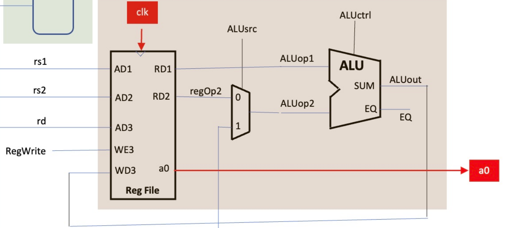
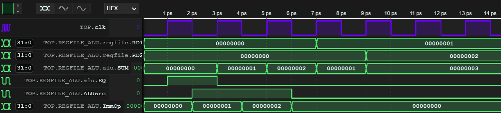
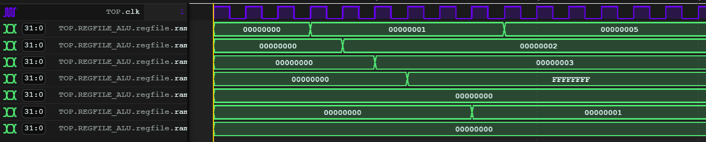

# `REGILE_ALU` Component

- [`REGILE_ALU` Component](#regile_alu-component)
    - [Component Description](#component-description)
    - [Testing](#testing)
  - [Problems Encountered](#problems-encountered)



<p style="text-align: center">Figure 1: Screenshot of schematic showing above components</p>


### Component Description

This component consists of `REGFILE`, which is a dual output synchronous RAM array storing 32, 32-bit registers, with 5-bit addresses—and an `ALU` which is directly connected to one of the two RAM outputs, with the other input connected through a multiplexer which can select either the second RAM output or a 32-bit immediate operand coming from the sign extension module. The ALU mode can be controlled as follows:

<div style="margin-left: auto;
            margin-right: auto;
            width: 40%">

| ALUctrl | Operation   |
|:-------:|:-----------:|
| `000`   | $A + B$     |
| `001`   | $A - B$     |
| `010`   | $A\ \And \ B$  |
| `101`   | $A - B > 0$ |

</div>

The top level component simply links the modules together as per the lab brief.

---

### Testing

The testbench has been created to test the components by modifying input values and checking what the output is.

```cpp
top->ImmOp = i == 0 ? 1 : i == 1 ? 2 : 0;
        top->ALUsrc = i < 2;
        top->RegWrite = i <= 2;
        top->rd = i; // keep data at 0 equal to 0
        top->rs1 = i >= 2 ? 1 : 0;
        top->rs2 = i >= 2 ? 2 : 0;
```
For instance, the above tests storing data into the RAM. This uses both components because we just add 0 to an immediate to enter a value into RAM, because, as per the schematic, the data in is the output of the ALU.
Once data is loaded, the adding functionality is tested by summing the values of both the registers.


<p style="text-align: center">Figure 2: Waveform showing above testing</p>

However, there are some issues with the above graph, notably that that ImmOp changes only on the negative edge of the clock. Furthermore, the process of entering the values is very difficult, so a better approach was required.

The first issue was due to the clock not initially being set to `1`. Another big issue that was detected was the fact that the RAM was completetly synchronous, whereas the instructions require asyncronous read. Having fixed both these issues, a better way to control the IO signals was required.

Using a switch means that signals can be set for each cycle. The following code tests all ALU ops.

```cpp
switch (i) {
        case 1: // set x10 to 1
        top->rs1 = 0;
        top->ALUsrc = 1;
        top->ALUctrl = 0;
        top->rd = 10;
        top->RegWrite = 1;
        top->ImmOp = 1;
        break;
        case 2: // set x11 to 2
        top->rd = 11;
        top->ImmOp = 2;
        break;
        case 3: // sum both and write to x12
        top->rs1 = 10;
        top->rs2 = 11;
        top->rd = 12;
        top->ALUsrc = 0;
        break;
        case 4: // write difference to x13
        top->rd = 13;
        top->ALUctrl = 1;
        break;
        case 5: // write AND to x14
        top->rd = 14;
        top->ALUctrl = 2;
        break;
        case 6: // write SLT to x15
        top->rd = 15;
        top->ALUctrl = 5;
        break;
        case 7: // set x10 higher than x11
        top->ALUsrc = 1;
        top->ALUctrl = 0;
        top->ImmOp = 5;
        top->rd = 10;
        top->rs1 = 0;
        break;
        case 8: // write SLT to x16
        top->ALUsrc = 0;
        top->ALUctrl = 5;
        top->rd = 16;
        top->rs1 = 10;
        break;
}
```
Giving the following waveform:

<p style="text-align: center">Figure 3: Waveform showing above testing</p>

## Problems Encountered

- Forgetting to set `clk` to `1` initially, which meant that the hardware was being evaluated on the falling edge, rather than rising edge.

- Having RAM read ansd write both be synchronous, when only write had to be asynchronous.
