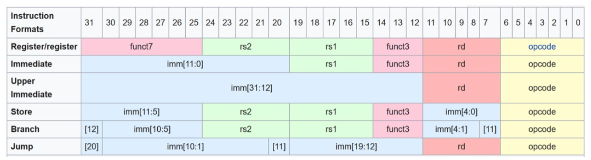

## Sign Extension Unit

- [Sign Extension Unit](#sign-extension-unit)
	- [I/O spec](#io-spec)
	- [Testing](#testing)


The immediate operand comes from different types of instructions and has varying size. The sign extend unit converts the immediate operand from the different instructions into a `32-bit` value and sign extends it.

The different instructions are in the following format:



This can be broken down into

* *Immediate*: 12 bits 
	* [11:0] from bit 31 to 20
* *Upper Immediate*: 20 bits 
	* [31:12] from bit 31 to 12
* *Store*: 11 bits 
	* [11:5] from bit 31 to 25
	* [4:0] from bit 11 to 7
* *Branch*: 13 bits, where the 0th bit is ignored because the branching instruction is executed on addresses which use byte-addressing. See lecture 6 Slide 20
	* [12] on bit 31
	* [11] on bit 7
	* [10:5] between bit 30 to 25
	* [4:1] between bit 11 to 8
* *Jump*: 21 bits
	* [20] on bit 31
	* [19:12] between bit 19 and bit 12
	* [11] on bit 20
	* [10:1] between bit 30 and bit 21

Therefore the `Sign extend` modules needs an input `ImmSrc` in order to distinguish between different types of immediates. The logic to determine this input will be implemented in `Control Unit`.

---

### I/O spec

* `ImmSrc` **[Input]** Coming from the control unit and encodes which instructions is being executed
	* There are 5 different instruction formats therefore 3 bits are needed:

        | Instruction Format | Code
        | --- | ---  
        | Immediate | 0b000
        | Upper Imm | 0b001
        | Store | 0b010
        | Branch | 0b011
        | Jump | 0b100

* `ImmOp` **[Output]** 32-bit sign extended immediate

---

### Testing

* *Store instruction*

	Using online assembler the following instructions are passed
	```as
	/* store instruction */
	sw x1, 100(x2)
	sw x1, -100(x2)
	```
* *Other instructions* 
	
	Painfully inserting values by hand in the correct bit location. Testbench shows circuit working as intended:

	```
	imm
	57: 57
	-57: -57
	upper imm
	big num: 59768832
	another big: 59768832 original: 59768844
	negative big: -59768832
	store
	100: 100
	-100: -100
	branch
	57 x 2: 114
	-57: -58
	jump
	57: 56
	-57: -58
	```

