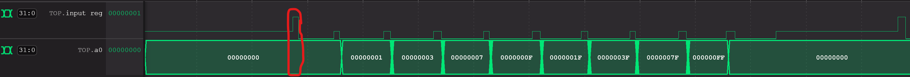
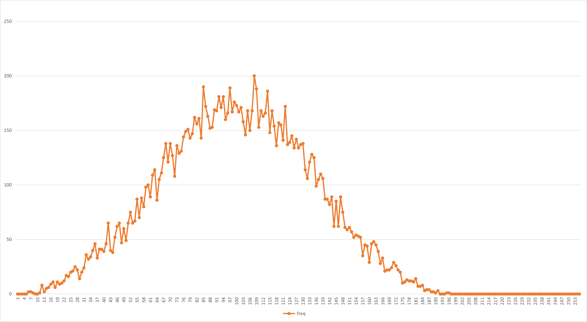
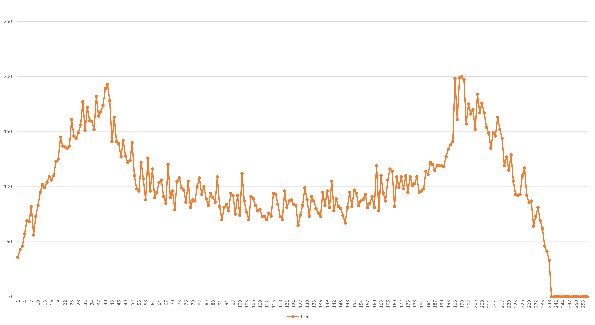
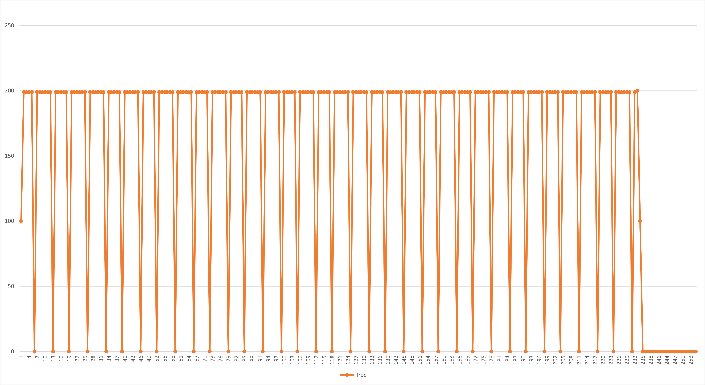
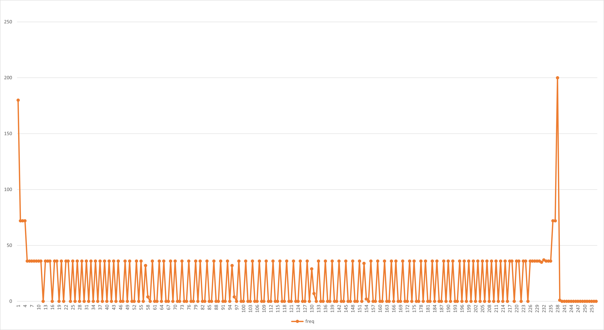

# F1 Assembly program

The program is tested using [this](https://www.cs.cornell.edu/courses/cs3410/2019sp/riscv/interpreter/#) website.

Even better testing [website](https://venus.kvakil.me/)

- [F1 Assembly program](#f1-assembly-program)
  - [Desired Behaviour](#desired-behaviour)
  - [Implementation](#implementation)
      - [1. Executing on trigger](#1-executing-on-trigger)
      - [2. Turning led lights on one at a time](#2-turning-led-lights-on-one-at-a-time)
      - [3. Testbench and VBuddy](#3-testbench-and-vbuddy)
  - [Issues](#issues)
    - [Pseudo-random number generation:](#pseudo-random-number-generation)
    - [1 second delay:](#1-second-delay)
    - [Input interference:](#input-interference)
  - [Results](#results)
- [PDF](#pdf)
        - [*How to run*](#how-to-run)
    - [Testbench](#testbench)
      - [Compute PDF](#compute-pdf)
      - [Display on *VBUDDY*](#display-on-vbuddy)
    - [Results](#results-1)
      - [gaussian.mem](#gaussianmem)
      - [noisy.mem](#noisymem)
      - [triangle.mem](#trianglemem)
      - [sine.mem](#sinemem)


## Desired Behaviour

1. Upon receving a trigger the routine is executed
2. The `a0` drives the led bar on the *VBuddy* turning on each light every second
3. The testbench uses *VBuddy* methods to measure how long it takes the user to press the button after the lights turn off

## Implementation

#### 1. Executing on trigger

- Register `x31` (`t6`) is used as a user input 
- Loop while bit 2 of `x31` is not `1`
- Once bit 2 of `x31` becomes `1` the rest of the program is executed
- At the end of the program `x31` is reset to `0` and ready to wait for another trigger input
- `x31` register has to be exposed to the top level component in order to be accessible by testbench

#### 2. Turning led lights on one at a time

- Loop 8 times using a temporary register (`t0`) 
- Each iteration shift `a0` left by 1 and add 1
- Call the `wait_second` subroutine which as the name implies loops indefinitely while the first bit of the `t6` register is not 1. The bit is selected with an `andi` instruction.

#### 3. Testbench and VBuddy

- Using `<chrono>` library the amount of time elapsed is measured every cycle.
- Once 1 second is reached the LSB of the `t6` register is flipped to `1` to signal to the program that 1 second has passed
- If the 2nd bit of the `t6` register is `0` this means that it's ok to send another bit of input, at this point the `vbdFlag()` is sampled in one shot mode and the result sent to the CPU.

## Issues

### Pseudo-random number generation:
- In order to have a useful pseudo-random number generator some sort of seed is needed. 
- One way to implement this is to expose a memory address to the testbench in order to have a random seed, which can then be fed to pseudo-random routine
### 1 second delay:
- In order to achieve one second delay between each turning on the CPU clock could be adjusted to execute one instruction per clock.
- This would however make it impossible to use the pseudo-random generator sub-routine as it would take too long, therefore an alternative has to be found

### Input interference:

**Problem**

The program uses the register `x31` or `t6` to interact with the testbench and user. The first bit of the register is set to 1 every second giving the program a known pulse and allowing for it to wait until this pulse arrives, this works under the assumption that checking if this value is 1 takes less than one second which fortunately it does. 
To allow for a trigger signal from the encoder on the Vbuddy the second bit of the register is used as signal. Here a problem is encountered however, since writing for the trigger input might overwrite the pulse input.

**Solution**

The register has to be exposed as an output for the testbench to be able to write to it without overwriting other values. This way the program can reset a given input bit to 0 signaling to the testbench that it's ready to receive another input. This then allows for up to 32 boolean inputs to the register. 

## Results

Running the program with the *VBuddy* confirms that it indeed works as intended.



Looking at the waveform, `input_reg` is the contents of the `x31` register which are being written to and from by both the testbench and the program. We can see that while the `input_reg` doesn't receive a trigger signal (red annotation) the program loops on itself and waits. Once the trigger input is received, `x31` is reset to `0` and the main program is executed. Here `a0` is shifted left and increased by 1 and then the `wait_second` subroutine is entered. Here the program again loops on itself waiting for bit `0` to switch to `HIGH`, this signal is coming from the testbench and indicates 1 second has elapsed. Once `a0` reaches `FF` the program goes back to waiting for a trigger signal and the whole thing repeats.

# PDF

The `pdf.s` program has been slightly modified from the one provided.

In order to easily save the computed values when they are displayed the register `a0` is set to be `-1`, this signals to the testbench that on the next cycle `a0` is being written with a value. 

##### *How to run*

After pluggin *VBUDDY* in, use `run.sh` from the RTL directory and pass the assembly file, `pdf`, the testbench, `pdf_tb` and some `.mem` file. For example:

```bash
source run.sh pdf pdf_tb triangle
```

This will run the program and generate an `out.csv` with the pdf for a given `data.mem` 

### Testbench

#### Compute PDF

Simulation is run for an arbitrarily long amount of cycles.

- When `a0` is equal to `-1` a boolean value is set to high
- If the boolean is high the value of `a0` is stored to an array and a counter is incremented
- Store the value in `out.csv` file

#### Display on *VBUDDY*  

Once all values are computed display on *VBUDDY*

- Loop from 0 to 240 (the resolution of the display on ***VBUDDY***)
- Use `vbdPlot()` to display the value

### Results

Running the program on *VBUDDY* proves it is working and yields the following plots. 

Here the generated values are stored in a `.csv` file and plotted on Excel as a proxy for the *VBUDDY* screen. 

#### gaussian.mem

 

#### noisy.mem



#### triangle.mem



#### sine.mem

